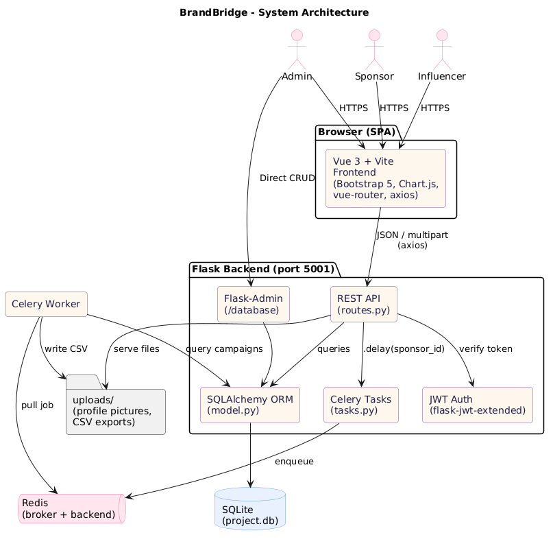
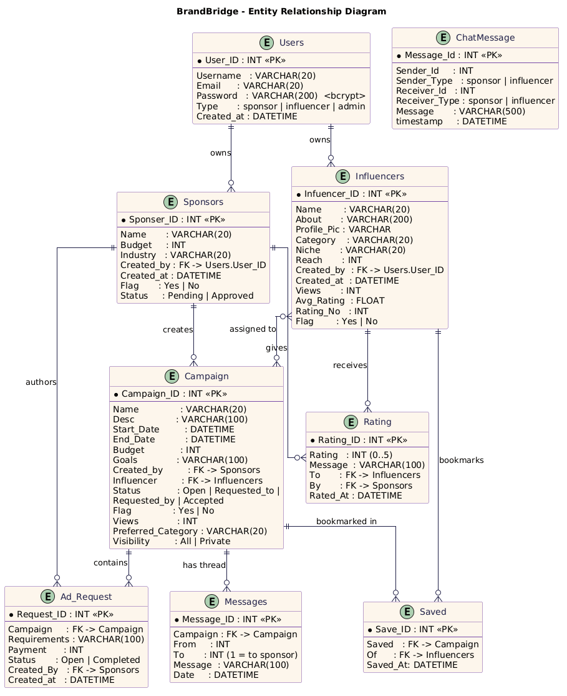
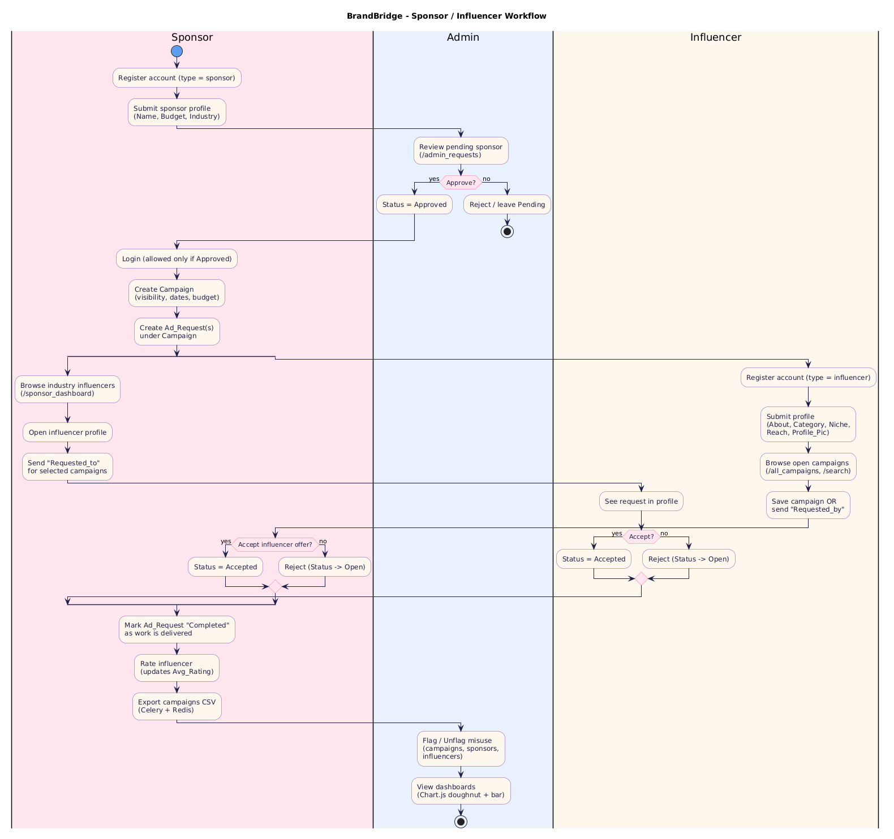

# BrandBridge

> **Sponsor ↔ Influencer Coordination Platform**
> A full-stack web app that lets brands (sponsors) discover influencers, run ad campaigns end-to-end, and lets admins moderate the marketplace.

Built with **Flask + SQLAlchemy + Celery + Redis** on the backend and **Vue 3 + Vite + Bootstrap 5 + Chart.js** on the frontend.

---

## Table of Contents

1. [Features](#features)
2. [Architecture](#architecture)
3. [Tech Stack](#tech-stack)
4. [Data Model](#data-model)
5. [End-to-End Workflow](#end-to-end-workflow)
6. [Project Structure](#project-structure)
7. [Getting Started](#getting-started)
8. [Environment & Configuration](#environment--configuration)
9. [API Reference](#api-reference)
10. [Frontend Routes](#frontend-routes)
11. [Known Issues / Hardening Notes](#known-issues--hardening-notes)
12. [License](#license)

---

## Features

### For Sponsors
- Register a brand profile (name, budget, industry) — must be approved by an admin before the first login.
- Create **campaigns** (public or private), set start/end dates, budget, goals and preferred influencer category.
- Create one or more **Ad Requests** under a campaign (deliverables + payment).
- Browse the top influencers in your industry, view their profile, rating and reach.
- Send a campaign request to a chosen influencer (`Requested_to`).
- Accept / reject inbound requests from influencers (`Requested_by`).
- Mark individual ad requests as **Completed** as work is delivered.
- **Rate** an influencer once a campaign wraps — feeds into their `Avg_Rating`.
- Charts (Chart.js): payment distribution per campaign, status mix, flagged ratio.
- **Export campaigns to CSV** — runs as a Celery background job; user polls a task id for the download.
- 1-to-1 chat with influencers.

### For Influencers
- Register a creator profile (about, category, niche, reach, avatar upload).
- Discover campaigns matching your category, plus a global feed (`/all_campaigns`) and free-text **search**.
- **Save** campaigns for later (`Saved` table).
- Accept / reject sponsor requests; send `Requested_by` to sponsors you want to work with.
- Profile shows active campaigns with a live **completion %** (ratio of completed ad requests).
- Stats page (Chart.js): rating histogram, payment per accepted campaign, completion bars.

### For Admins
- Auto-generated **Flask-Admin** UI at `/database` for direct CRUD on every table.
- Custom dashboard at `/adminhome` with doughnut + bar charts for sponsors / influencers / campaigns and flagged-content ratios.
- Approve pending sponsors (`/admin_requests`).
- **Flag / unflag** sponsors, influencers and campaigns (flagged accounts cannot log in; flagged campaigns are hidden from feeds and search).
- Dedicated views per entity (`/admin_sponsors`, `/admin_influencers`, `/admin_campaigns`, `/admin_flagged`).

### Cross-cutting
- JWT-secured session (`flask-jwt-extended`) — token cached in `localStorage`, attached on every axios call.
- Bcrypt-hashed passwords.
- File uploads stored under `backend/uploads/` and served via `/uploads/<filename>`.
- Toast notifications (`vue3-toastify`) for every success / failure path.

---

## Architecture



> _Source: [docs/diagrams/architecture.puml](docs/diagrams/architecture.puml)_

| Layer | Component | Responsibility |
|---|---|---|
| Browser | Vue 3 SPA (Vite) | Routing, rendering, axios calls |
| API | Flask + Blueprint (`routes.py`) | ~50 JSON endpoints |
| Auth | `flask-jwt-extended` + `flask-bcrypt` | Token issue / verify, password hashing |
| ORM | SQLAlchemy + Flask-Migrate | 9 tables (see ER below) |
| Admin | Flask-Admin (`/database`) | Generic CRUD over every model |
| Async | Celery worker + Redis | Long-running jobs (CSV export) |
| Storage | SQLite (`instance/project.db`) | App data |
| Files | `uploads/` directory | Profile pictures, generated CSVs |

---

## Tech Stack

**Backend** &nbsp; Flask · Flask-SQLAlchemy · Flask-Migrate · Flask-JWT-Extended · Flask-Bcrypt · Flask-CORS · Flask-Admin · Celery · Redis · pandas · flask-excel

**Frontend** &nbsp; Vue 3 (Composition API) · Vue Router 4 · Vite 5 · Bootstrap 5 + Bootstrap Icons · Chart.js 4 · axios · vue3-toastify

**Database** &nbsp; SQLite (dev). The schema is plain SQLAlchemy and migrates cleanly to Postgres / MySQL.

---

## Data Model



> _Source: [docs/diagrams/er.puml](docs/diagrams/er.puml)_

Nine tables modelled in [backend/model.py](backend/model.py):

| Table | Purpose |
|---|---|
| `Users` | Auth root. `Type` ∈ {sponsor, influencer, admin}. |
| `Sponsors` | Brand profile owned by a `User`. Has `Status` (Pending / Approved) and `Flag`. |
| `Influencers` | Creator profile owned by a `User`. Stores reach, niche, rolling `Avg_Rating`. |
| `Campaign` | Owned by a sponsor, optionally assigned to an influencer. `Status` ∈ {Open, Requested_to, Requested_by, Accepted}. |
| `Ad_Request` | A deliverable inside a campaign (requirements + payment + Open/Completed). |
| `Messages` | Public comment thread on a campaign. |
| `Rating` | Sponsor-to-influencer star rating with optional message. |
| `Saved` | Influencer bookmarks of campaigns. |
| `ChatMessage` | 1-to-1 direct messaging between any two users. |

---

## End-to-End Workflow



> _Source: [docs/diagrams/workflow.puml](docs/diagrams/workflow.puml)_

The diagram captures the three-actor flow:

1. **Sponsor** signs up → admin approves → sponsor creates campaign + ad requests.
2. **Influencer** signs up → browses / searches campaigns → either gets requested by a sponsor or sends their own offer.
3. Either side can accept; once accepted, the sponsor closes out individual ad requests and rates the influencer.
4. **Admin** moderates throughout (flagging, approvals, dashboards).

---

## Project Structure

```
BrandBridge/
├── backend/
│   ├── app.py              # Flask app factory + entrypoint (port 5001)
│   ├── extensions.py       # db, migrate, bcrypt, jwt, cors instances
│   ├── model.py            # SQLAlchemy models (9 tables)
│   ├── routes.py           # All REST endpoints (Blueprint)
│   ├── admin.py            # Flask-Admin registration -> /database
│   ├── tasks.py            # Celery task: create_resource_csv
│   ├── worker.py           # Celery factory bound to Flask app context
│   ├── celeryconfig.py     # Redis broker/backend URLs
│   ├── instance/
│   │   └── project.db      # SQLite database (created on first run)
│   └── uploads/            # Profile pictures + generated CSVs
│
├── frontend/
│   ├── index.html
│   ├── package.json
│   ├── vite.config.js
│   └── src/
│       ├── main.js
│       ├── App.vue
│       ├── router/index.js # 30+ routes
│       ├── components/     # SponsorHeader, InfluencerHeader, AdminHeader, Circles
│       └── views/          # 30+ page components
│
├── docs/
│   └── diagrams/           # PlantUML + rendered PNGs + render script
│
└── README.md
```

---

## Getting Started

### Prerequisites

| Tool | Version |
|---|---|
| Python | 3.10+ |
| Node.js | 18+ |
| Redis  | 6+ (required for CSV export task) |

### 1 — Backend

```bash
cd backend
python -m venv .venv
# Windows:
.\.venv\Scripts\Activate.ps1
# macOS / Linux:
source .venv/bin/activate

pip install flask flask-sqlalchemy flask-migrate flask-bcrypt \
            flask-jwt-extended flask-cors flask-admin flask-excel \
            celery redis pandas
```

> _A `requirements.txt` is not committed — the dependency list above is derived from imports in `app.py`, `routes.py`, `worker.py`, `tasks.py`._

Start Redis (any of these):
```bash
# Native install
redis-server

# Docker
docker run -p 6379:6379 redis:7
```

Start the Flask API (creates `instance/project.db` on first run):
```bash
python app.py
# -> http://127.0.0.1:5001
```

Start the Celery worker in a second terminal (same venv):
```bash
celery -A app.celery_app worker --loglevel=info
```

> On Windows, Celery 5 needs `--pool=solo` to actually execute tasks:
> `celery -A app.celery_app worker --loglevel=info --pool=solo`

### 2 — Frontend

```bash
cd frontend
npm install
npm run dev
# -> http://localhost:5173
```

### 3 — First-time bootstrap

1. Open http://localhost:5173, register an **admin** user (pick `admin` in the type field).
2. Register a sponsor → approve them from the admin panel (`/admin_requests`).
3. Register an influencer.
4. Create campaigns, send requests, rate, export CSV — every feature is reachable from the role-specific header.

The auto-generated database admin is at **http://127.0.0.1:5001/database**.

---

## Environment & Configuration

These are hard-coded in [backend/app.py](backend/app.py) and [backend/celeryconfig.py](backend/celeryconfig.py) — change them before going anywhere near production:

| Key | Default | Where |
|---|---|---|
| `SQLALCHEMY_DATABASE_URI` | `sqlite:///./project.db` | `app.py` |
| `SECRET_KEY` | `your_secret_key_here` | `app.py` |
| `UPLOAD_FOLDER` | `uploads` | `app.py` |
| `API_BASE_URL` | `http://localhost:5001` | `app.py` |
| Celery broker | `redis://localhost:6379/1` | `celeryconfig.py` |
| Celery backend | `redis://localhost:6379/2` | `celeryconfig.py` |
| Frontend API base | `http://127.0.0.1:5001` | hard-coded in every view |

---

## API Reference

A non-exhaustive map of the JSON endpoints exposed by [backend/routes.py](backend/routes.py).

### Auth
| Method | Path | Purpose |
|---|---|---|
| POST | `/register` | Create a `Users` row (returns `user_id`). |
| POST | `/sponsor_register` | Attach a `Sponsors` profile to a user. |
| POST | `/influencer_register` | Attach an `Influencers` profile (multipart, accepts avatar). |
| POST | `/login` | Returns a JWT `access_token`. Blocks flagged or unapproved accounts. |
| GET  | `/protected` | Returns the decoded user + their sponsor/influencer record. |

### Sponsor flows
| Method | Path | Purpose |
|---|---|---|
| GET  | `/sponsor_dashboard?user_id=` | Industry feed of influencers + open campaigns + own campaigns. |
| GET  | `/sponsor_profile?sponsor_id=` | Active / ended / requested-by-influencer campaigns with completion %. |
| GET  | `/sponsor_stats?sponsor_id=` | Chart datasets (payment, status, flagged). |
| POST | `/create_campaign` | New campaign. |
| GET/POST | `/update_campaign` | Read or update a campaign (also returns its ad requests). |
| DELETE | `/delete_campaign/<id>` | Cascades to ad requests. |
| POST | `/create_request` | New ad request under a campaign. |
| GET/POST | `/update_request` | Read or update an ad request. |
| DELETE | `/delete_ad/<id>` | Delete an ad request. |
| POST | `/request_to_influencer` | Push selected campaigns to an influencer (`Requested_to`). |
| POST | `/accept_campaign/<id>` · `/reject_campaign/<id>` | Resolve an influencer-initiated request. |
| POST | `/mark_ad/<id>` · `/undo_ad/<id>` | Toggle ad-request completion. |
| POST | `/rate` | Rate an influencer (recomputes rolling `Avg_Rating`). |
| GET  | `/my_campaigns?user_id=` | Sponsor's own active campaigns. |
| GET  | `/change_campaign?campaign_id=` | List ad requests of a campaign with status. |

### Influencer flows
| Method | Path | Purpose |
|---|---|---|
| GET  | `/influencer_dashboard?user_id=` | Personalised campaign feed (category match). |
| GET  | `/all_campaigns?influencer_id=` | Global open-campaign feed. |
| GET  | `/saved_campaigns?influencer_id=` | Influencer's bookmarks. |
| GET  | `/influencer_profile?influencer_id=` | Active + requested-to campaigns with completion %. |
| GET  | `/influencer_stats?influencer_id=` | Chart datasets (ratings, payments, completion). |
| GET/POST | `/update_influencer` | Read or update profile (avatar via multipart). |
| POST | `/request_by_influencer` | Send an offer to a sponsor's campaign (`Requested_by`). |
| POST | `/save_campaign` · `/unsave_campaign` | Toggle bookmark. |

### Public / shared
| Method | Path | Purpose |
|---|---|---|
| GET  | `/View_influencer?influencer_id=&sponsor_id=` | Public influencer profile + ratings (increments `Views`). |
| GET/POST | `/show_campaign?campaign_id=&influencer_id=` | Public campaign detail + message thread. |
| POST | `/create_comment` | Append a message to a campaign thread. |
| GET  | `/search?q=&filter=&category=` | Ranked search across campaigns + influencers. |
| GET  | `/uploads/<filename>` | Serve uploaded file. |

### Admin
| Method | Path | Purpose |
|---|---|---|
| GET  | `/admin_home` | Aggregate chart datasets. |
| GET  | `/admin_campaigns` · `/admin_sponsors` · `/admin_influencers` · `/admin_flagged` | Listings. |
| POST | `/flag_campaign/<id>` · `/unflag_campaign/<id>` | Toggle campaign flag. |
| POST | `/flag_sponsor/<id>` · `/unflag_sponsor/<id>` | Toggle sponsor flag. |
| POST | `/flag_influencer/<id>` · `/unflag_influencer/<id>` | Toggle influencer flag. |
| GET  | `/pending_sponsors` | Sponsors awaiting approval. |
| POST | `/approve_sponsor/<id>` | Approve a pending sponsor. |

### Chat
| Method | Path | Purpose |
|---|---|---|
| GET  | `/chat/<member1_id>/<member2_id>` | Message history + display names. |
| POST | `/send_message` | Persist a new chat message. |

### Async (Celery + Redis)
| Method | Path | Purpose |
|---|---|---|
| GET  | `/download_csv/<sponsorid>` | Enqueue CSV export, returns `task_id`. |
| GET  | `/get_csv/<taskid>` | Poll task; streams the file when ready. |

---

## Frontend Routes

Defined in [frontend/src/router/index.js](frontend/src/router/index.js).

| Path | View | Audience |
|---|---|---|
| `/` | `HomeView` | Anyone (redirects to role home or `/login`) |
| `/login` · `/register` · `/logout` | Auth | Anyone |
| `/sponsor_register/:creator` · `/influencer_register/:creator` | Profile bootstrap | After `/register` |
| `/sponsorhome` · `/sponsor_profile` · `/sponsor_stats` · `/my_campaigns` | Sponsor area | Sponsor |
| `/create` · `/create_request/:campaign` · `/update/:campaign` · `/update_request/:ad` · `/change_campaign/:campaign` | Campaign authoring | Sponsor |
| `/rate/:influencer` · `/view_influencer/:influencer` | Influencer interactions | Sponsor |
| `/influencerhome` · `/influencer_profile` · `/influencer_stats` · `/all_campaigns` · `/saved_campaigns` · `/update_influencer` | Influencer area | Influencer |
| `/adminhome` · `/admin_campaigns` · `/admin_sponsors` · `/admin_influencers` · `/admin_flagged` · `/admin_requests` | Moderation | Admin |
| `/show_campaign/:campaign` · `/search` | Public | Anyone signed in |
| `/chat/:chatter1/:chatter2` | DM | Sponsor / Influencer |

---

## Known Issues / Hardening Notes

The codebase is a working academic project, not production-ready. If you fork it, these are the obvious next steps:

- **Secrets** — `SECRET_KEY` is committed; move it to an env var.
- **CORS** — `cors.init_app(app)` is wide-open; lock down to the frontend origin.
- **Auth coverage** — only a handful of endpoints are `@jwt_required`; most rely on caller-supplied IDs.
- **Server-side input validation** — many endpoints trust the JSON body shape.
- **Field sizes** — several `VARCHAR(20)` columns (email, name, password) are too small in practice.
- **API base URL** — `http://127.0.0.1:5001` is hard-coded in each Vue view; lift it into an env-driven `axios` instance.
- **Type typo** — model column is `Infuencer_ID` (missing "l"). Renaming requires a migration.
- **CSV files** are written to the working directory rather than `UPLOAD_FOLDER`.

---

## License

No license file is currently committed. Add one (MIT / Apache-2.0 / etc.) before publishing.
